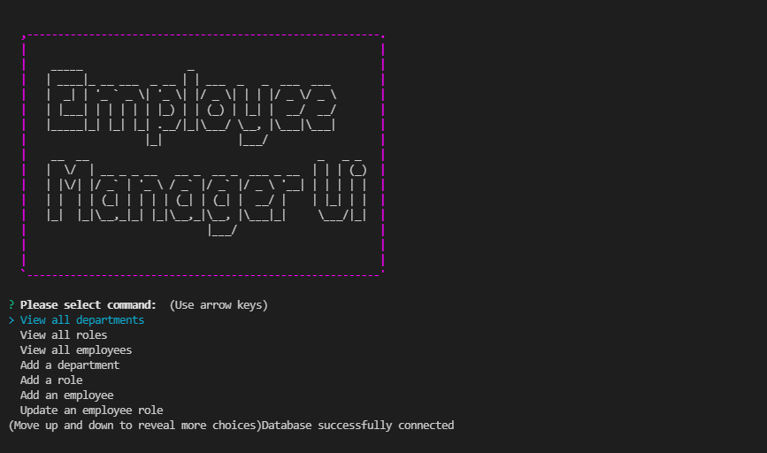

# Employee-Tracker

## Description

A quick command line application created to help manage an employee database

## Demo Link

https://youtu.be/FojqOSGlruI

## GitHub Link

https://github.com/mkang987/Employee-Tracker

## Installation

-First make sure to run npm install
-SOURCE the schema.sql and seed.sql using mySql
-Start the application by using "node index.js"

